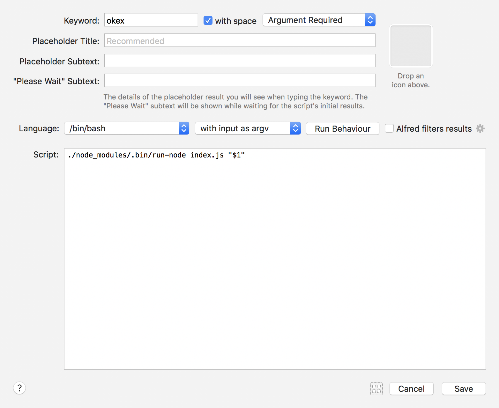
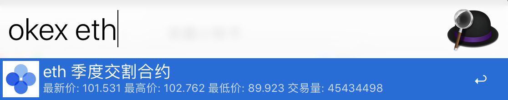

okex 交割合约 workflow
---

需要安装 node8+

> okex 开发文档中的 api 在国内需要科学上网，但是移动端使用的 api 不用，所以抓包后，使用了移动端调用的 api




备忘
okex 移动端 api 地址列表

```
https://okexcomreal.bafang.com:10441
https://okexcomweb.bafang.com
https://apstat.bafang.com
```

## 使用

```
okex eth
okex btc
...
```
